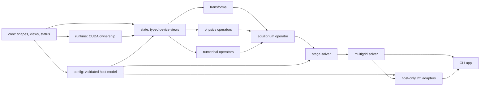
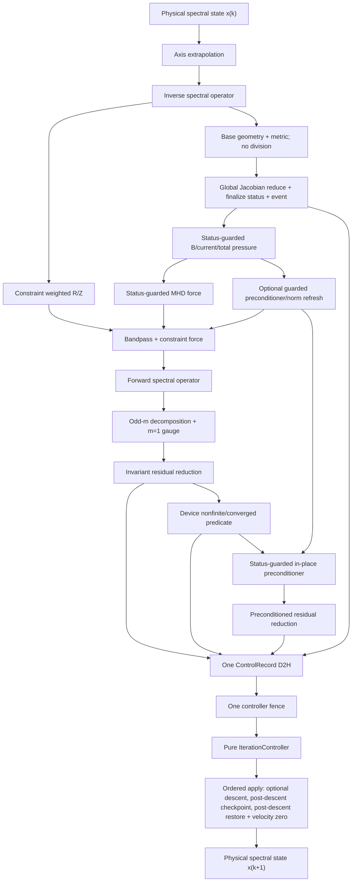

# cuMES CUDA overhaul blueprint

Status: architecture proposal updated after the first containment series  
Legacy numerical baseline: `7bc9d04dbc36331acee7025fe6a136275ed61f5e`  
Input/output integration baseline: remote `eaba051a24a8891da08d9c8c65ba34e99eaad85b`  
Current audited baseline: remote `631a16a4c25dde1c94fb001070f62c4200e533c8`  
Reference algorithm: VMEC++ 0.7.0, pinned to an exact source revision when the baseline is frozen

## 1. Executive decision

cuMES should be overhauled by **strangling the current implementation behind tested operator interfaces**, not by replacing the solver in one large rewrite. The present code already reproduces valuable VMEC numerical trajectories and has a reasonably efficient CUDA transform path. The `e5ff649..631a16a` containment series repaired the known OOB, several size-coverage errors, stale diagnostics, parser/output failure paths, and dead dependencies. The remaining problems are unsafe ownership, implicit mathematical representations, a monolithic controller, provisional size limits and numerical guards, incomplete regression coverage, and build/runtime coupling that still make aggressive optimization risky.

The target should retain:

- the folded stellarator-symmetric Fourier representation;
- the current surface-fast spectral layout and point-fast real-space layout;
- staggered full/half radial grids;
- multigrid continuation and the exact restart/damping order;
- a hybrid cuFFT/direct-poloidal reference backend;
- JSON input plus explicit legacy-v0 adapters for the current binary, NetCDF, and HDF5 state containers;
- precise double as the verification configuration.

It should replace:

- raw owning device pointers with RAII buffers and typed non-owning views;
- structs that mix configuration, derived constants, mutable state, and scratch;
- synchronous, default-stream operators with asynchronous stream-explicit operators;
- provisional launch/row caps and the current shared-memory PCR implementation with size-independent kernels;
- solver-internal dump buffers with versioned on-demand diagnostics;
- remaining print-driven diagnostics and partial CTest coverage with CPU references, assertion-bearing sanitizers, and trajectory gates;
- global compiler flags with target-scoped precise/fast/profiling presets.

The first milestone is not a speedup. It is completion of the corrected baseline started by `e5ff649..631a16a`: every containment fix has a dedicated regression, supported small paths are sanitizer-clean, unsupported input is rejected before allocation, every diagnostic has a versioned producer, and corrected Solovev/W7-X trajectories are frozen. Performance work starts only after that gate.

## 2. Audit evidence and present baseline

The audit traced the full iteration through `main.cu`, `solver.cu`, Fourier synthesis/projection, geometry, force, constraint, preconditioner, profiles, and refinement. It also inspected the merged JSON/NetCDF/HDF5 branch on the remote TITAN Xp.

The original input/output integration baseline rebuilt successfully. At current HEAD `631a16a`, the project was rebuilt again, all five registered CTest entries passed (`test_fourier`, `test_input_json`, `test_forces`, and the Fourier/force Compute Sanitizer variants), and an end-to-end double Solovev run remained trajectory-identical on all three grids:

| Stage | `ns` | Effective iterations | Final controlling result |
| ----: | ---: | -------------------: | -----------------------: |
|     1 |    5 |                  251 |                converged |
|     2 |   11 |                  199 |                converged |
|     3 |   55 |                  456 |         `FSQR=9.583e-17` |

The final stage also reported `FSQZ=4.273e-18` and `FSQL=5.053e-22`; the corrected run wrote the legacy binary state and reported 906 total effective iterations. This is evidence that the safe Solovev trajectory was preserved, not proof that every repaired path has a regression gate.

At `eaba051`, a targeted one-pass prescribed-current W7-X run under Compute Sanitizer confirmed the highest-risk defect: thread 32 in `updateIotaChipFKernel<double>` made an 8-byte global read one element beyond the 32-double `ns-1` half-grid allocation at `ns=33`. Repeating the same `ns=33`, `ncurr=1`, one-effective-pass run at `631a16a` reached that kernel and ended with `ERROR SUMMARY: 0 errors`; the process then returned the expected nonconvergence status because its iteration cap was deliberately set to one. This closes the reproduced OOB, but the case should become a permanent CTest regression instead of remaining a manual audit command.

Existing profiling documents are also useful baselines rather than promises. They report roughly 1.68 ms/effective iteration for W7-X on a TITAN Xp after the August optimization pass, and roughly 0.534 ms/effective iteration on an RTX 4090. The overhaul must reproduce those measurements under a controlled harness before claiming improvement.

Historical hotspot measurements explain the priority order:

| Platform | Dominant reported work per W7-X iteration                                                                                                                                                                   |
| -------- | ----------------------------------------------------------------------------------------------------------------------------------------------------------------------------------------------------------- |
| TITAN Xp | inverse accumulation about 0.397 ms, forward reduction about 0.391 ms, force about 0.167 ms, geometry about 0.115 ms                                                                                        |
| RTX 4090 | forward reduction about 0.110 ms, inverse accumulation kernels about 0.106 ms total, cuFFT about 0.055 ms, force about 0.041 ms, geometry about 0.033 ms, tridiagonal and residual work about 0.027 ms each |

These numbers came from different profiling sessions and are not cross-GPU speed ratios. They show that structural transform work matters more than generic occupancy tuning, while host synchronization matters increasingly as kernels get shorter.

### 2.1 Current source map

| Current area                            | Responsibility                                                                       | Architectural debt to remove                                                                                             |
| --------------------------------------- | ------------------------------------------------------------------------------------ | ------------------------------------------------------------------------------------------------------------------------ |
| `src/main.cu`                           | CLI, state allocation/initialization, stage loop, output preflight/output            | Application owns raw state and embeds multigrid/status policy; capability preflight is early now, but not a typed CLI contract. |
| `src/input_json.cu`, `include/input.h`  | VMEC-like JSON defaults, validation, boundary folding                                | Host-only code is still compiled by nvcc; capacities are fixed; validation is improved but warnings/limits are not a versioned strict schema and lack a negative-test matrix. |
| `src/fourier.cu`, `include/fourier.cuh` | cuFFT plans, pack/recover, poloidal synthesis/projection, many real fields and dumps | Dead cuBLAS state and unproduced force buffers are gone, but `FourierPlan` still mixes transform state, physics storage, diagnostics, and scratch. |
| `src/profiles.cu`                       | Full/half-grid profile evaluation and upload                                         | Nonzero gamma is now rejected and dead buffers are gone; immutable prescribed data and evolving geometry-dependent quantities remain mixed. |
| `src/geometry.cu`                       | Staggered geometry, covariant metric, B field, current closure, norm partials        | The LCFS OOB is fixed and a validity check exists, but geometry/B/current/norm remain coupled and the Jacobian check is a synchronous, provisional absolute-magnitude reduction. |
| `src/forces.cu`                         | Real-space weak-form R/Z/lambda forces                                               | Correctness-sensitive expressions live in one large register-heavy kernel with no scalar reference gate.                 |
| `src/constraint.cu`                     | Weighted R/Z reconstruction, bandpass, reference/reset, constraint force             | Theta coverage and launch tiling are repaired and `tcon0` propagates; the module still repeats transform work and reaches into transform scratch/plans. |
| `src/precon.cu`                         | Surface statistics, matrix construction, PCR, lambda preconditioning                 | Grid-stride PCR now covers the validated `ns<=512` range, but the backend has a shared-memory cap, absolute pivot floors, synchronized reductions, and no solver/fallback contract. |
| `src/solver.cu`                         | Entire fixed-point loop, reductions, damping, restart, backup, diagnostics           | Monolithic numerical state machine plus CUDA scheduling; five ordinary-path host barriers/iteration after adding synchronous Jacobian stats; observers still affect data production. |
| `src/refine.cu`                         | Coarse-to-fine spectral prolongation                                                 | Important parity/axis/LCFS rules are implicit in a raw-pointer kernel.                                                   |
| `src/output*.cu`                        | D2H copies, printing, binary/NetCDF/HDF5 writing                                     | Writers now return status and preflight optional backends, but host I/O is compiled by nvcc, transfers are duplicated, files are not atomically published, and stage provenance is incomplete. |
| `tests/*.cu`                            | Fourier assertions and several print-driven diagnostics                              | CTest/small memcheck registration exists and the six-family overflow is fixed; parser/output repair cases, prescribed-current OOB, and fixture-dependent diagnostics are not permanent gates. |

The current per-iteration sequence is:

1. extrapolate axis coefficients;
2. inverse hybrid transform to parity-split R/Z/lambda and derivatives;
3. build half-grid geometry, field, and pressure/current closure;
4. reconstruct constraint R/Z fields;
5. on refresh cadence, rebuild preconditioner, normalization, and `tcon`;
6. evaluate real-space MHD plus constraint forces;
7. forward transform to six spectral-force families;
8. apply odd-mode decomposition and the `m=1` gauge;
9. reduce invariant residuals and check convergence/nonfinite state;
10. apply the preconditioner and reduce preconditioned residuals;
11. update damping/restart/checkpoint decisions and descend.

This ordering is the initial compatibility contract. The target architecture makes the dependencies explicit before changing any of them.

### 2.2 Merged input/output branch assessment

The four integration commits from `7bc9d04` through `eaba051` are worth keeping: they replace hardcoded configuration with two JSON fixtures and add binary/NetCDF/HDF5 selection. The following five commits through `631a16a` are also the correct overhaul base because they contain the first verified containment pass. These remain transition adapters, not yet stable solver interfaces.

The generated Solovev NetCDF header demonstrates the current fixed-capacity model: dimensions include `ngrids=8`, `ncoeff=16`, `naxis=32`, and `nbm=nbn=16` even though the active run uses only part of them. It records only the final stage's `iterations`, not total/per-stage history, and records folded boundary matrices but not a source hash or the raw harmonic list. The redesign should preserve readable compatibility while replacing padded implementation capacities with active dimensions and versioned provenance.

The transpose-sensitive v0 mapping must be pinned explicitly: a NetCDF/HDF5 logical value `family[surface, mode]` corresponds to device/storage offset `surface + mode*ns`. Golden tests must catch an accidental declaration/data-order transpose.

### 2.3 Containment series now in the baseline

The latest six remote commits, including the prior I/O tip, are:

| Commit | Baseline effect | Overhaul interpretation |
| ------ | --------------- | ----------------------- |
| `eaba051` | Improves the disabled-backend diagnostic with linked-library hints. | Preserve as legacy CLI behavior; replace the string/suffix dispatcher with typed `OutputSpec`. |
| `e5ff649` | Removes the unused cuBLAS handle/link and dead profile buffers. | This Phase 1 cleanup is complete; do not reintroduce cuBLAS without a measured operation. |
| `fe19a4e` | Repairs the reproduced geometry OOB, PCR/de-alias coverage, launch tiling, parser/physics validation, `tcon0`, output status/preflight, diagnostic producers, numerical guards, and adds provisional Jacobian checks. | Treat these as corrected legacy behavior and build new interfaces around them. Several implementations are deliberately interim and still need focused tests or replacement. |
| `adb11ae` | Corrects covariant-metric, parity-Jacobian, and log-ratio damping documentation. | Use the formulas in section 4 as the normative contracts; the older `AGENTS.md` formulas are not an oracle. |
| `d39b8c9` | Ignores the no-backend verification build directory. | Retain the no-backend configuration as an explicit CI matrix entry. |
| `631a16a` | Restricts Compute Sanitizer registration to tests that launch CUDA kernels. | Correct harness behavior; extend coverage by adding self-contained kernel-driving regressions rather than wrapping host-only tests. |

The series materially advances Phase 0, but a passing five-test CTest run is not yet the Phase 0 exit gate. `test_forces` remains a print-oriented diagnostic, `test_force_verify` and `test_geometry_iso` still require external artifacts and are not registered, the new parser branches have no dedicated negative cases, and no output failure/schema test was added.

## 3. Containment status and remaining Phase 0 work

The first containment series has landed. “Landed” below means the unsafe behavior is removed in code; it does not imply that the target architecture or its permanent regression is complete. “Partial” means the immediate failure is guarded but the implementation still has a known contract, testing, or scalability gap.

| Priority | Finding | Status at `631a16a` | Remaining overhaul work |
| -------- | ------- | -------------------- | ----------------------- |
| P0 | LCFS OOB in `updateIotaChipFKernel`. | **Landed and manually verified.** The LCFS branch returns before reading half-grid arrays; the reproduced W7-X memcheck now reports zero errors. | Register fixed-iota and prescribed-current memcheck cases as self-contained tests; only then consider skipping the fixed-iota update launch. |
| P0 | `test_force_verify` allocated five families while `forwardDFT` wrote six, and left `lmncs` uninitialized. | **Landed.** It now allocates/reads six families and uploads/frees `lmncs`. | Replace the raw count with a component enum/typed slab and remove the external `vmecpp_init.bin` dependency so the test can be registered. |
| P0 | PCR covered only 128 solved rows. | **Contained.** Each PCR round now uses a row grid-stride loop, and JSON caps `ns` at 512. | Add CPU comparison tests above/below 128 rows and replace the 10·`ns` dynamic-shared-memory backend with a scalable/fallback policy. |
| P0 | De-alias analysis silently omitted theta samples above 32. | **Landed in code.** The kernel loops over all 32-point theta groups. | Add manufactured cases at 31/32/33 and awkward maximum sizes; compare against a scalar projection. |
| P0 | Combined geometry dumps were stale and combined force dumps had no producer. | **Landed for current dumps.** Force buffers/dumps were removed; geometry is combined on demand at the dump site. | Move all diagnostics to versioned snapshots with explicit state/iteration provenance and no hot-path ownership. |
| P0 | `tcon0` was parsed but ignored. | **Landed.** `GridParams::tcon0` scales the constraint profile. | Add a non-unit `tcon0` operator/trajectory regression and move it into immutable validated stage parameters. |
| P0 | Nonzero gamma advertised unsupported physics. | **Landed.** Nonzero `adiabatic_index` is rejected. | Add negative parsing tests; implement gamma only through a separately verified pressure/`dV/ds` model. |
| P0 | Negative boundary `m` could index folding arrays out of bounds. | **Landed for safety.** Negative/out-of-range modes are skipped with a warning. | Add a regression; in schema v1, decide strict rejection versus named compatibility-mode skipping before dynamic folding. |
| P0 | Empty multigrid arrays allowed a zero-stage run. | **Landed.** The parser requires at least one stage and caps `ns` entries to `[3,512]`. | Add empty/oversized/mismatched schedule tests and move limits into checked `GridShape`/backend capability validation. |
| P0 | Output errors were lost and convergence alone determined exit status. | **Partial.** Writers return `bool`, check write/close results, remove partial paths on reported failure, and affect the CLI exit code. | Publish via temp-file + flush/sync + atomic rename, use structured errors, and avoid calling a close routine again from the close-failure cleanup path. Test open/write/close/truncation failures for every backend. |
| P0 | An unlinked requested backend was rejected after the solve via deep `exit`. | **Landed for known suffixes.** `main` preflights before CUDA initialization and libraries return failure. | Replace suffix strings with validated `OutputSpec`; make strict unknown-suffix/default behavior explicit and remove remaining deep exits from lower-level CUDA/I/O helpers. |
| P1 | Jacobian division preceded a validity decision. | **Partial and provisional.** Reciprocal consumers have guards and a synchronous min/max/nonfinite check runs before later operators. | Replace the host copy/fence with reset→reduce→finalize device status. Track oriented sign, not only `abs(g)`. Fix reduction identities for inactive lanes—on small grids, zero-initialized idle threads can win the minimum—and gate every dependent/cache-mutating kernel. |
| P1 | Normalization, gauge, PCR pivots, and lambda scaling lacked robust denominator policy. | **Partial.** Several zero checks and sign-preserving `copysign` floors were added. | Replace absolute `1e-30`-style floors with scale-aware typed policies and structured numerical status; add scaled singular/breakdown tests. |
| P1 | Partial-warps used `0xffffffff` shuffle masks. | **Landed in code.** Reductions use the active mask at the converged point. | Keep small-block memcheck/synccheck cases and migrate complicated reductions to tested primitives where beneficial. |
| P1 | Full theta/zeta products produced large or invalid blocks. | **Contained.** Transform/constraint launches tile zeta and parser caps angular extents. | Benchmark tile policies, derive launch limits from device/backend capability, and add tail/max-size regressions rather than treating 256 as the final API limit. |
| P1 | Float builds accepted impossible double-tuned tolerances. | **Contained.** Float CLI startup rejects stage tolerances below `1e-6`. | Replace the hardcoded gate with `PrecisionPolicy`, measured floors, mixed-accumulation options, and float trajectory tests. |
| P1 | cuBLAS and dead profile buffers had no consumers. | **Complete.** `e5ff649` removed the handle/link and dead allocations. | None in the current design; require evidence before adding another dependency or stored profile field. |
| P1 | Tests were not registered and print-only diagnostics looked like tests. | **Partial.** CTest now registers three executables and two memcheck variants. | Convert `test_forces` from a print-oriented diagnostic to numerical assertions, add output/parser/geometry/constraint/preconditioner tests, and label diagnostics separately from gates. |
| P1 | Force/geometry diagnostics used uninitialized data, fixed indices, or absent fixtures. | **Partial.** `lmncs`, cleanup, mode labeling, and geometry index/assertion handling improved. | Generate self-contained typed fixtures; register them and compare numerical results, not only nonzero write coverage. |
| P1 | Integer narrowing/extents and unknown JSON keys were weakly validated. | **Partial.** Integer narrowing is checked, angular/radial caps exist, and unknown keys warn. | Use checked products and semantic bounds for every derived extent (including physical mode products); default schema v1 to strict unknown-key rejection and use unique temporary files in tests. |
| P1 | Unsupported auxiliary/asymmetric keys could bypass wrong-type checks. | **Landed in code.** Recognized keys are type-checked before support rejection. | Add scalar/object/nonempty-array negative tests for every category. |

Commit `adb11ae` corrected the headline documentation defects: the current code stores a **covariant** metric, its Jacobian is the parity-staggered `R_H * tau` expression described below rather than a direct `(1 + lambda_theta)` formula, and the damping controller uses a residual log-ratio rather than the square root of the maximum residual. Section 4 remains the normative mathematical contract.

## 4. Non-negotiable numerical contracts

The redesign may change storage, scheduling, and kernel decomposition, but these contracts must be explicit and covered by component tests.

### 4.1 Coordinates, grids, and indexing

Use normalized flux coordinate

\[
s*j = \frac{j}{n_s-1},\qquad
s*{j+1/2} = \frac{j+1/2}{n_s-1},\qquad
\Delta s = \frac{1}{n_s-1}.
\]

Keep these logical layouts:

- spectral: `[component][mode][surface]`, with surface contiguous;
- full-grid real: `[surface][zeta][theta]`, with theta/point contiguous;
- half-grid real: `[half_surface][zeta][theta]`;
- compact reduced theta quadrature: a distinct typed view, never an integer reinterpretation of a full-grid view.

All element-count products must use checked `size_t` arithmetic. `GridShape::validate()` must verify radial minima, even/reduced theta requirements, cuFFT-compatible zeta sizes, mode ranges, quadrature coverage, launch limits, and the selected backend's constraints before any allocation.

### 4.2 Folded Fourier representation

For the stored nonnegative toroidal index `n`, define the physical toroidal mode

\[
N = n\,n\_{\mathrm{fp}}.
\]

The stellarator-symmetric product basis is

\[
\begin{aligned}
R(s,\theta,\zeta) &= \sum*{m,n}
\left[R^{cc}*{mn}(s)\cos(m\theta)\cos(n\zeta)
+R^{ss}_{mn}(s)\sin(m\theta)\sin(n\zeta)\right],\\
Z(s,\theta,\zeta) &= \sum_{m,n}
\left[Z^{sc}_{mn}(s)\sin(m\theta)\cos(n\zeta)
+Z^{cs}_{mn}(s)\cos(m\theta)\sin(n\zeta)\right],\\
\lambda(s,\theta,\zeta) &= \sum*{m,n}
\left[L^{sc}*{mn}(s)\sin(m\theta)\cos(n\zeta)
+L^{cs}\_{mn}(s)\cos(m\theta)\sin(n\zeta)\right].
\end{aligned}
\]

For raw signed-`n` boundary harmonics and `n>0`, folding into this product basis is

\[
\begin{aligned}
R^{cc}_{m,n}&=rbc(m,+n)+rbc(m,-n),&
R^{ss}_{m,n}&=rbc(m,+n)-rbc(m,-n)\quad(m>0),\\
Z^{sc}_{m,n}&=zbs(m,+n)+zbs(m,-n)\quad(m>0),&
Z^{cs}_{m,n}&=zbs(m,-n)-zbs(m,+n).
\end{aligned}
\]

At `n=0`, `rbc` is accumulated once into `Rcc`, and `zbs` contributes to `Zsc` only for `m>0`; sine-in-zeta families vanish and `zbs(0,0)` has no basis function. Duplicate raw entries are summed deliberately. Folding validation precedes any fixed/device packing.

Poloidal derivatives multiply by `m`; physical toroidal derivatives multiply by `N`, not the raw stored `n`. The existing inverse path deliberately represents

\[
l_v = -\partial_v\lambda.
\]

That sign convention must be part of the field type or name.

The state contains physical Fourier amplitudes. Forces and velocities use the VMEC-decomposed representation. A state update therefore reapplies the mode normalization

\[
S*{mn}=m*{\mathrm{scale}}n*{\mathrm{scale}},\qquad
m*{\mathrm{scale}}=\begin{cases}1&m=0\\\sqrt2&m>0\end{cases},\quad
n\_{\mathrm{scale}}=\begin{cases}1&n=0\\\sqrt2&n>0\end{cases}.
\]

The `m=1` `R^{ss}/Z^{cs}` pair uses a trajectory-sensitive mixed gauge. For decomposed forces, let the incoming unmixed pair be `(f_Rss,f_Zcs)`. The mixed pair is

\[
\tilde f*{Rss}=\frac{f*{Rss}+f*{Zcs}}{\sqrt2},\qquad
\tilde f*{Zcs}=\frac{f*{Rss}-f*{Zcs}}{\sqrt2}.
\]

The second component is instead set to zero when

\[
\texttt{iter2}<2\quad\text{or}\quad
\mathrm{FSQZ}\_{\mathrm{previous}}<10^{-6}.
\]

The same mixed representation is used by velocity. Because physical state is stored in the undone gauge, its `m=1` increments are

\[
\Delta R^{ss}=\Delta t\,S*{mn}(v*{Rss}+v*{Zcs}),\qquad
\Delta Z^{cs}=\Delta t\,S*{mn}(v*{Rss}-v*{Zcs}).
\]

Before the radial solve, the odd-parity `m=1` pair is scaled with

\[
d=a*{R,d}+b*{R,d}+a*{Z,d}+b*{Z,d},\qquad
\tilde f*{Rss}\leftarrow\frac{a*{R,d}+b*{R,d}}{d}\tilde f*{Rss},\qquad
\tilde f*{Zcs}\leftarrow\frac{a*{Z,d}+b*{Z,d}}{d}\tilde f*{Zcs},
\]

using a scale-aware check on `d`. These conversions must be named operations, not duplicated index arithmetic.

Axis and boundary rules are also part of the representation contract:

- before every inverse transform, copy all six `m=1` families from surface 1 to the axis;
- for `m=0`, copy the `Lcs` family from surface 1 to the axis (the chi-force leftover);
- descent skips every `m>0` axis coefficient;
- fixed-boundary R/Z coefficients do not move at the LCFS;
- both lambda families remain free at the LCFS.

Initially preserve the current in-place axis extrapolation for Class A compatibility. The structured target should later stage extrapolated axis values as a transform input view instead of conflating them with canonical persisted coefficients. Legacy-v0 output preserves the current axis row; schema v1 records its axis convention explicitly. That separation is a Class B/format change and must retain identical real-space axis geometry and force trajectory.

For odd `m`, the real-space work representation is regularized as

\[
q_o^{\mathrm{work}}(s)=
\frac{q_o^{\mathrm{physical}}(s)}
{\max(\sqrt{s},\sqrt{\Delta s})}.
\]

Physical state, regularized odd work values, decomposed residuals, decomposed velocities, and mixed-gauge values are different domains and should have different C++ view types.

### 4.3 Forward quadrature

The forward transform uses the reduced theta trapezoid, not a generic FFT round-trip normalization. For `nThetaRed = ntheta/2 + 1`, its weight is

\[
w*{k,m,n}=
\frac{m*{\mathrm{scale}}n*{\mathrm{scale}}}
{n*\zeta(n\_{\theta,\mathrm{red}}-1)}\,e_k,
\qquad
e_k=\begin{cases}\tfrac12&k\text{ is a theta endpoint}\\1&\text{otherwise.}\end{cases}
\]

The exact endpoint, axis, LCFS, parity, and zero-mode rules should live in one `QuadraturePlan`/`ModeTable`, shared by CPU reference and GPU code.

### 4.4 Profiles

Let

\[
T(s)=s\sum*i a*{\Phi i}s^i.
\]

The normalized toroidal-flux coordinate used by the power-series profiles is

\[
t(s)=\min(T(s),1),\qquad
\widehat t(s)=\min\left(|bloat\,t(s)|,1\right).
\]

Then the toroidal-flux derivative is

\[
\Phi'(s)=
\frac{\operatorname{signJ}\,\Phi\_{\mathrm{edge}}}
{2\pi T(1)}T'(s),
\]

and for fixed-iota mode

\[
\chi'(s)=\iota(s)\Phi'(s).
\]

For fixed-iota mode,

\[
\iota(s)=\sum*i a*{\iota i}t(s)^i.
\]

For pressure, apply the pedestal clamp before the toroidal-flux mapping:

\[
s*p=\min(s,s*{\mathrm{pres,ped}}),\qquad
\widehat t_p=\min\left(|bloat\,\min(T(s_p),1)|,1\right).
\]

The current gamma-zero implementation stores pressure in magnetic units:

\[
p(s)=\mu*0\,p*{\mathrm{scale}}\sum*i a*{Mi}\widehat t_p^{i}.
\]

For prescribed-current mode, define the integrated polynomial, its bloat-clamped radial profile, and the separately normalized edge value

\[
J*C(x)=\sum_i\frac{a*{Ci}}{i+1}x^{i+1},\qquad
C*H(s)=J_C(\widehat t(s)),\qquad
C*{edge}=J_C\left(\min(|bloat|,1)\right),
\]

then normalize

\[
I*{tor}=\frac{\operatorname{signJ}\,\mu_0\,curtor}{2\pi C*{edge}},\qquad
I*H(s)=I*{tor}C_H(s).
\]

`C_edge` is intentionally independent of `T(1)`; replacing it by `C_H(1)` changes general non-unit toroidal-flux profiles.

Its lambda normalization is

\[
L=\lambda*{\mathrm{scale}}=
\sqrt{\Delta s\sum*{j+1/2}\Phi'(s\_{j+1/2})^2}.
\]

`Phi'_H` in this sum is evaluated directly at `s_H`. By contrast, magnetic-field construction currently uses the full-grid average

\[
\Phi'\_{F\to H}=\frac12\left(\Phi'\_F(j)+\Phi'\_F(j+1)\right),
\]

which is not generally equal to direct half-grid evaluation for nonlinear `T(s)`. Both arrays and their consumers must remain distinct.

Validation requires nonzero, well-scaled `T(1)`, `C_edge` when prescribed current is active, plasma-volume/norm denominators, and `lambda_scale`. The new profile module separates immutable prescribed data from geometry-dependent evolving quantities. Until a gamma-dependent pressure law and `dV/ds` are implemented, only `gamma=0` is supported and `dV/ds=1` remains an explicit compatibility model.

The current full-grid parity helper uses `sqrt(s+1e-12)` at the axis while transforms/refinement use exact `sqrt(s)`. Phase 0 preserves this as `AxisRegularizationPolicy::LegacyEpsilon`; a later exact-axis policy may remove it only as a Class B numerical change with dedicated axis and trajectory tests.

### 4.5 Half-grid interpolation and geometry

For an even/odd parity pair, the current staggered interpolation is

\[
q*H=\frac12\left[(q*{e,j}+q*{e,j+1})
+\sqrt{s_H}(q*{o,j}+q\_{o,j+1})\right],
\]

\[
q*{s,H}=\frac{q*{e,j+1}-q*{e,j}
+\sqrt{s_H}(q*{o,j+1}-q\_{o,j})}{\Delta s}.
\]

The code forms

\[
\tau*1=R*{u,H}Z*{s,H}-R*{s,H}Z\_{u,H},\qquad
\tau=\tau_1+\frac14\tau_2,\qquad
\sqrt g=R_H\tau,
\]

where, writing the two neighboring full surfaces as `in` and `out`,

\[
\begin{aligned}
\tau*2={}&R*{u,o}^{out}Z*o^{out}+R*{u,o}^{in}Z*o^{in}
-Z*{u,o}^{out}R*o^{out}-Z*{u,o}^{in}R*o^{in}\\
&+\frac{1}{\sqrt{s_H}}\left(
R*{u,e}^{out}Z*o^{out}+R*{u,e}^{in}Z*o^{in}
-Z*{u,e}^{out}R*o^{out}-Z*{u,e}^{in}R_o^{in}
\right).
\end{aligned}
\]

This parity correction must be transcribed into a named, unit-tested host/device function; it must not be replaced by the simplified expression in the old project notes without a separate derivation and differential proof.

The stored metric is covariant:

\[
g*{uu}=R_u^2+Z_u^2,\qquad
g*{uv}=R*uR_v+Z_uZ_v,\qquad
g*{vv}=R^2+R_v^2+Z_v^2,
\]

with the current parity-staggered averaging applied to each term.

Validity uses the orientation-adjusted statistic

\[
J*{min}=\min*{H,\theta,\zeta}\left(\operatorname{signJ}\sqrt g\right),\qquad
J*{scale}=\max*{H,\theta,\zeta}|\sqrt g|.
\]

A stage point set is valid only when the nonfinite count is zero and

\[
J*{min}>\kappa_J\,\epsilon_T\,J*{scale},
\]

where `kappa_J` is a documented policy constant and the degenerate `J_scale=0` case is invalid. This definition avoids treating the normally negative raw Jacobian as a failure merely because of coordinate orientation.

### 4.6 Magnetic field and pressure

Using \(l_v=-\partial_v\lambda\),

\[
B^v=\frac{L\lambda*u+\Phi'*{F\to H}}{\sqrt g},\qquad
B^u=\frac{Ll_v+\chi'}{\sqrt g}.
\]

The covariant components and total pressure are

\[
B*u=g*{uu}B^u+g*{uv}B^v,\qquad
B_v=g*{uv}B^u+g\_{vv}B^v,
\]

\[
P\_{\mathrm{tot}}=p+\frac12\left(B^uB_u+B^vB_v\right).
\]

For prescribed-current mode, the half-grid closure is

\[
\chi'_H=
\frac{I_H-\left\langle g_{uu}B^u*\lambda+g*{uv}B^v\right\rangle}
{\left\langle g\_{uu}/\sqrt g\right\rangle},
\qquad
\iota_H=\frac{\chi'\_H}{\Phi'\_H}.
\]

The `ncurr=0` and `ncurr=1` data flows should be separate policy paths so fixed profiles cannot accidentally execute or mutate the current-closure state.

### 4.7 Force operator

The weak-form force kernel builds the reusable half-grid fluxes

\[
Q=R*HP*{\mathrm{tot}},\qquad
G*{uu}=\sqrt g(B^u)^2,\qquad
G*{uv}=\sqrt g B^uB^v,\qquad
G\_{vv}=\sqrt g(B^v)^2,
\]

then combines radial differences with poloidal and toroidal derivative terms for the even and odd parity families. The exact current equations should be copied first into a scalar CPU reference with the same operation order. Only after differential tests pass should the GPU implementation be split, fused, or algebraically simplified.

The hybrid lambda force uses

\[
r_b=0.1(1-s),
\]

\[
F*{\lambda,u}=-L\left[(1-r_b)\langle B_v\rangle+r_bB*{v,\mathrm{alt}}\right],
\qquad
F\_{\lambda,v}=-L\langle B_u\rangle.
\]

These `-L` formulas apply for `j>0`. At the magnetic axis, the current compatibility operator deliberately leaves the blended `B_v` average and the `B_u` average positive and unscaled by `-L`; its odd output then uses the configured axis `sqrt(s)` helper. `B_v_alt` must be a named expression with its own manufactured test because it mixes `g_vv/sqrt(g)`, normalized `lambda_u`, and `g_uv B^u`. The axis exception requires a direct regression test.

### 4.8 Spectral-condensation constraint

Define

\[
x\_{mpq}=m(m-1),
\]

and reconstruct

\[
R*{\mathrm{con}},Z*{\mathrm{con}}
=\sum*{m,n}x*{mpq}\{R*{mn},Z*{mn}\}\,\mathrm{basis}\_{mn}.
\]

With the LCFS-extrapolated reference fields `R_con,0`, `Z_con,0`,

\[
R*{\mathrm{con},0}(s)=s\,R*{\mathrm{con},\mathrm{LCFS}},\qquad
Z*{\mathrm{con},0}(s)=s\,Z*{\mathrm{con},\mathrm{LCFS}},
\]

This reference is reset on the first pass and after every restart, i.e. when `iter2 == iter1`.

and therefore

\[
g*{\mathrm{eff}}=
(R*{\mathrm{con}}-R*{\mathrm{con},0})R_u+
(Z*{\mathrm{con}}-Z\_{\mathrm{con},0})Z_u.
\]

The bandpass covers `m=1,...,mpol-2`. The current per-mode scale is

\[
f\_{\mathrm{accon}}(m)=\frac{1}{4m^2(m+1)^2}
\]

for the actual poloidal mode `m`, combined with the user `tcon0`. Mode limits, de-alias quadrature, and reference-reset cadence must be explicit inputs to the operator.

The current radial multiplier should receive the parsed input through

\[
M\_{tcon}=tcon0\,
\frac{1+n_s\left(1/60+n_s/24000\right)}{16},
\]

followed by the existing surface normalization

\[
tcon*j=\min\left(\frac{|a*{R,d,j}^{even}|}{\langle R*u^2\rangle_j},
\frac{|a*{Z,d,j}^{even}|}{\langle Z*u^2\rangle_j}\right)
M*{tcon}(32\Delta s)^2,
\]

with `tcon[j=0]=0` on the magnetic axis and the current LCFS half-weight. The overhaul should preserve this formula first, while replacing its exact-zero fallbacks with scale-aware validation.

### 4.9 Preconditioner

For each `(m,n)` and parity, the R/Z tridiagonal approximation uses

\[
D\_{mn}= -\left(A_d^{(p)}+m^2B_d^{(p)}+N^2C_d\right),
\]

\[
U*{j,mn},L*{j,mn}= -\left(A_h^{(p)}+m^2B_h^{(p)}\right)
\]

It solves

\[
L*jx*{j-1}+D*jx_j+U_jx*{j+1}=f_j.
\]

In current array names, `ar[j]` is `U_j`, the outer/super-diagonal multiplying `x[j+1]`, and `br[j]` is `L_j`, the inner/sub-diagonal multiplying `x[j-1]`. The target API uses `lower/diagonal/upper` names to prevent this historical naming trap.

The operator solves this as a batch over mode/component systems. The backend contract must state its supported row range and numerical pivot policy; a backend must never silently process only a prefix of the rows.

For fixed boundary,

\[
j\_{min}(m)=\begin{cases}0&m=0\\1&m>0\end{cases},
\]

and the R/Z solve covers `j_min,...,ns-2`; the LCFS row is excluded. For `m=1`, the lower coefficient at `j=1` is folded into the first solved diagonal, `D_1 <- D_1+L_1`, enforcing the axis treatment. The lambda diagonal applies through the LCFS but is zero at the axis and for the `(m,n)=(0,0)` gauge mode.

The lambda factor is

\[
f*\lambda=N^2b*\lambda+2mN\operatorname{copysign}(d*\lambda,b*\lambda)+m^2c\_\lambda,
\]

Here `copysign(d,b)=sign(b)|d|`; it is not `sign(b)*d` when `d<0`. Any proposed change to this expression must first establish the intended VMEC++ contract with a differential test.

\[
P*\lambda=
\frac{2}{4L^2}
\frac{(\sqrt{s})^{\min(m^2/256,8)}}{f*\lambda}.
\]

Every denominator must be checked relative to a norm of its local coefficients. A breakdown returns `NumericalStatus::SingularPreconditioner`; it must not be converted silently to a positive constant.

### 4.10 Residual, damping, and descent

Force normalization is refreshed with the preconditioner when

\[
(\texttt{iter2}-\texttt{iter1})\bmod 25=0,
\]

where `iter1` is the latest restart anchor and `iter2` is the effective iteration. Diagnostic mode must not add a refresh and thereby change the trajectory.

With reduced-grid trapezoidal weight `w`, define

\[
\begin{aligned}
E*{mag}&=\left|\sum \sqrt g\,\frac{|B|^2}{2}w\right|\Delta s,\\
E*{therm}&=\left(\sum*H p_H\frac{dV}{ds}\_H\right)\Delta s,\\
V&=\left(\sum_H\frac{dV}{ds}\_H\right)\Delta s,\\
e&=\frac{\max(E*{mag},E*{therm})}{V},\\
S*{RZ}&=\sum g\_{uu}R_H^2w,\\
S_L&=\sum(B_u^2+B_v^2)w.
\end{aligned}
\]

Then

\[
f*{norm,RZ}=\frac{1}{S*{RZ}e^2},\qquad
f*{norm,L}=\frac{1}{S_L\,L^2},\qquad
f*{norm,1}=\frac{1}{RZNorm}.
\]

`RZNorm` is the squared decomposed R/Z state norm: divide physical coefficients by `S_mn`, exclude the `Rcc(0,0)` offset and stored `m>0` axis values, and use a factor `1/2` for the squared `m=1` `Rss/Zcs` pair because of its mixed representation. Every denominator above must pass a scale-aware positive check.

The invariant residuals are

\[
\begin{aligned}
\mathrm{FSQR}&=\frac14 f*{\mathrm{norm,RZ}}
\sum[(F_R^{cc})^2+(F_R^{ss})^2],\\
\mathrm{FSQZ}&=\frac14 f*{\mathrm{norm,RZ}}
\sum[(F_Z^{sc})^2+(F_Z^{cs})^2],\\
\mathrm{FSQL}&=f*{\mathrm{norm,L}}
\sum[(F*\lambda^{sc})^2+(F\_\lambda^{cs})^2].
\end{aligned}
\]

Convergence requires all three invariant components to satisfy their stage tolerance, equivalently

\[
\max(\mathrm{FSQR},\mathrm{FSQZ},\mathrm{FSQL})\le f\_{tol}.
\]

After preconditioning, define the controller scalar

\[
\begin{aligned}
\mathrm{FSQR1}&=f*{norm,1}\sum[(P^{-1}F_R^{cc})^2+(P^{-1}F_R^{ss})^2],\\
\mathrm{FSQZ1}&=f*{norm,1}\sum[(P^{-1}F_Z^{sc})^2+(P^{-1}F_Z^{cs})^2],\\
\mathrm{FSQL1}&=\Delta s\sum[(P^{-1}F_\lambda^{sc})^2+(P^{-1}F_\lambda^{cs})^2],\\
f_k&=\mathrm{FSQR1}\_k+\mathrm{FSQZ1}\_k+\mathrm{FSQL1}\_k.
\end{aligned}
\]

The damping estimate is based on the residual log-ratio:

\[
\tau*k^{-1}=
\frac{\min\left(\left|\log(f_k/f*{k-1})\right|,0.15\right)}{\Delta t}.
\]

The ten-entry history has exact restart/zero rules:

- whenever `iter2 == iter1`, fill all ten entries with `0.15/Delta t`;
- shift the history once per evaluated pass;
- insert a new log-ratio sample only when `iter2 > iter1`;
- if `f_k == 0`, insert zero rather than evaluating the logarithm;
- on the restart-anchor pass, the last entry remains the initialized `0.15/Delta t` value.

After the existing ten-sample average,

\[
d*\tau=\frac{\Delta t}{2}\overline{\tau^{-1}},\qquad
b_1=1-d*\tau,\qquad
f*{\mathrm{ac}}=\frac{1}{1+d*\tau}.
\]

The accelerated descent is

\[
v^{k+1}=f*{\mathrm{ac}}\left(b_1v^k+\Delta t\,P^{-1}F^k\right),
\qquad
x^{k+1}=x^k+\Delta t\,S*{mn}v^{k+1}.
\]

For a finite pass that reaches time-step control, the exact application order is:

1. compute the refresh/restart decision from the current residuals;
2. execute descent;
3. if progress requests refresh, copy the **post-descent** physical state to the checkpoint;
4. if a restart was selected, restore the older checkpoint after descent and zero velocity, thereby discarding that descent;
5. increment the effective iteration only on a non-restart pass.

A nonfinite invariant residual follows the earlier exceptional path: restore and reduce the step without executing descent. The ordering of invariant residual, preconditioning, preconditioned residual, damping history, restart decision, descent, post-descent checkpoint refresh, and post-descent restore is part of the numerical contract. The new controller must reproduce it from a pure state machine before any ordering change is attempted.

With `f_min` the running minimum of the preconditioned sum and `age=iter2-iter1`, the current control predicates are

\[
\begin{aligned}
refresh&:\quad f*k\le f*{min}\ \land\ age>10,\\
bad_jacobian&:\quad f*k>100f*{min}\ \land\ iter2>iter1,\\
bad_progress&:\quad age>12\ \land\ iter2>50\ \land\
(\mathrm{FSQR}+\mathrm{FSQZ})>10^{-2}.
\end{aligned}
\]

`bad_jacobian` multiplies `Delta t` by `0.9`; `bad_progress` divides it by `1.03`; both reset the restart anchor. These historically named conditions are distinct from the earlier oriented-Jacobian device status and should receive clearer enum names in schema v1 while legacy telemetry retains the original labels.

There is also a top-of-pass convergence-problem branch. If the accumulated bad-Jacobian counter equals 25 or 50, before axis extrapolation or geometry the solver restores the checkpoint, increments the counter, sets

\[
\Delta t=
\begin{cases}
0.98\,\Delta t*{initial},&\text{post-increment counter}<50,\\
0.96\,\Delta t*{initial},&\text{otherwise},
\end{cases}
\]

resets the restart/log anchors, and continues without geometry, descent, or effective-iteration increment. This maintenance pass must be represented explicitly by `IterationController::next_schedule()` and included in trajectory replay.

### 4.11 Multigrid prolongation

Odd modes are interpolated in the scaled coordinate

\[
x*c(s)=\frac{x*{\mathrm{physical}}(s)}
{\max(\sqrt{s},\sqrt{\Delta s\_{\mathrm{old}}})}.
\]

The old-axis stencil is `2*x_c(s1)-x_c(s2)`. The result is unscaled on the new grid, new odd-mode axis entries are zero, and the LCFS is copied exactly. These four rules need direct property tests for all six coefficient families.

## 5. Target repository scaffold

```text
cuMES/
├── CMakeLists.txt
├── CMakePresets.json
├── cmake/
│   ├── CumesOptions.cmake
│   ├── CumesWarnings.cmake
│   ├── CumesCudaArchitectures.cmake
│   ├── CumesSanitizers.cmake
│   └── CumesDependencies.cmake
├── configs/
│   ├── schema-v1.json
│   ├── solovev.json
│   └── w7x.json
├── include/cumes/
│   ├── core/
│   │   ├── result.hpp
│   │   ├── scalar.hpp
│   │   ├── checked_size.hpp
│   │   ├── grid_shape.hpp
│   │   ├── mode_table.hpp
│   │   └── tensor_view.cuh
│   ├── runtime/
│   │   ├── cuda_status.hpp
│   │   ├── device_buffer.cuh
│   │   ├── device_arena.cuh
│   │   ├── stream.cuh
│   │   ├── event.cuh
│   │   ├── pinned_buffer.hpp
│   │   └── device_context.hpp
│   ├── config/
│   │   ├── problem_spec.hpp
│   │   ├── solver_options.hpp
│   │   ├── precision_policy.hpp
│   │   ├── validated_problem.hpp
│   │   └── json_reader.hpp
│   ├── state/
│   │   ├── spectral_components.hpp
│   │   ├── spectral_state.cuh
│   │   ├── real_fields.cuh
│   │   └── stage_workspace.cuh
│   ├── transforms/
│   │   ├── spectral_operator.hpp
│   │   ├── axisymmetric_operator.hpp
│   │   └── toroidal_fft_operator.hpp
│   ├── physics/
│   │   ├── profiles.hpp
│   │   ├── geometry_operator.hpp
│   │   ├── magnetic_field_operator.hpp
│   │   ├── force_operator.hpp
│   │   └── constraint_operator.hpp
│   ├── numerics/
│   │   ├── residual_operator.hpp
│   │   ├── preconditioner.hpp
│   │   ├── tridiagonal_backend.hpp
│   │   ├── descent_operator.hpp
│   │   └── prolongation.hpp
│   ├── solver/
│   │   ├── control_record.hpp
│   │   ├── iteration_controller.hpp
│   │   ├── equilibrium_operator.hpp
│   │   ├── stage_solver.hpp
│   │   ├── multigrid_solver.hpp
│   │   └── observer.hpp
│   └── io/
│       ├── output_spec.hpp
│       ├── equilibrium_snapshot.hpp
│       ├── run_report.hpp
│       ├── reader.hpp
│       └── writer.hpp
├── src/
│   ├── app/main.cpp
│   ├── runtime/*.cu
│   ├── config/*.cpp
│   ├── state/*.cu
│   ├── transforms/{axisymmetric,toroidal_fft}.cu
│   ├── physics/{profiles,geometry,magnetic_field,force,constraint}.cu
│   ├── numerics/{residual,preconditioner,tridiagonal,descent,prolongation}.cu
│   ├── solver/{iteration_controller,stage_solver,multigrid_solver}.cpp
│   └── io/{binary,netcdf,hdf5}.cpp
├── tests/
│   ├── unit_cpu/
│   ├── unit_cuda/
│   ├── integration/
│   ├── regression/
│   ├── sanitizer/
│   ├── performance/
│   ├── reference/
│   └── fixtures/
├── benchmarks/
│   ├── fixed_iteration.cu
│   ├── transforms.cu
│   ├── force_operator.cu
│   └── tridiagonal.cu
├── tools/
│   ├── compare_trajectory.py
│   ├── compare_snapshot.py
│   └── summarize_benchmark.py
└── docs/
    ├── architecture.md
    ├── mathematics.md
    ├── data-layout.md
    ├── verification.md
    ├── performance.md
    └── adr/
```

### 5.1 Dependency rule

Dependencies must form an acyclic graph. In particular, transforms cannot own force fields, constraint code cannot reach into Fourier scratch, output cannot include solver implementation headers, and the controller cannot call CUDA directly.



`io` consumes a host `EquilibriumSnapshot` and `RunReport`; it never sees a device pointer. The arrows into `App` mean the executable composes modules, not that libraries depend on the executable.

## 6. Core component design

### 6.1 Configuration: parse, validate, derive, pack

Use four distinct stages:

1. `ProblemSpec`: dynamic, user-facing values exactly as parsed—boundary harmonic vectors, profile variants, axis coefficients, stage schedule, and optional fields.
2. `ValidationReport`: all errors and warnings, including unknown keys, unsupported physics, duplicate modes, impossible precision/tolerance combinations, integer narrowing, extent overflow, and backend limits.
3. `ValidatedProblem`: immutable host model whose construction proves the invariants needed by the solver.
4. `DeviceParams<T>`: compact trivially-copyable constants and tables packed for a particular stage and scalar type.

Illustrative host model:

```cpp
struct BoundaryHarmonic {
  int m;
  int n;                 // signed input convention
  double value;
};

struct StageRequest {
  std::size_t radial_surfaces;
  std::size_t max_iterations;
  double tolerance;
};

struct ProblemSpec {
  int mpol;
  int ntor;
  int field_periods;
  AngularResolution angular;
  CurrentModel current_model;
  ProfileSpec mass_or_pressure;
  ProfileSpec iota_or_current;
  std::vector<BoundaryHarmonic> rbc;
  std::vector<BoundaryHarmonic> zbs;
  std::vector<double> raxis_c;
  std::vector<double> zaxis_s;
  std::vector<StageRequest> stages;
  PhysicalScalars physical;
};

Result<ValidatedProblem> validate(
    ProblemSpec spec,
    const SolverOptions& options,
    const RuntimeCapabilities& capabilities);
```

The JSON implementation belongs in a host `.cpp` target. A host-only parser or output backend should not dictate the language mode, compile definitions, dependencies, or nvcc compilation environment of the CUDA solver target. The current two JSON files become compatibility fixtures. Strict mode should reject unknown keys; an explicitly named compatibility mode may warn and preserve VMEC++-style ignored keys.

Preflight the requested output suffix and linked backend before initializing CUDA. Empty stage arrays, negative `m`, invalid `ntheta/nzeta`, oversized integers, and checked-product overflow are input errors, not kernel failures.

### 6.2 Shapes and mode metadata

`GridShape` owns extents only. It does not own pointers or physical values.

```cpp
struct GridShape {
  int ns;
  int ntheta;
  int nzeta;
  int mpol;
  int ntor;
  int nfp;

  [[nodiscard]] std::size_t full_points() const;
  [[nodiscard]] std::size_t half_points() const;
  [[nodiscard]] std::size_t modes() const;
  [[nodiscard]] ValidationReport validate() const;
};

template<class T>
struct ModeEntry {
  int m;
  int n;
  int physical_n;
  int first_surface;
  T mn_scale;
  T xmpq;
  ModeParity parity;
};
```

The actual `ModeEntry<T>` table is built once per resolution, uploaded once, and read by transform, constraint, residual, preconditioner, and descent kernels. It removes repeated division/modulo, square roots, parity branches, and duplicated normalization rules.

`QuadraturePlan<T>` similarly owns reduced-theta indices, endpoint weights, and angular normalization. CPU and CUDA reference paths consume the same generated host tables.

### 6.3 Typed views

Use a small tensor view that carries pointer, extents, and layout at compile time where practical:

```cpp
enum class SpectralComponent : std::uint8_t {
  Rcc, Zsc, Lsc, Rss, Zcs, Lcs, Count
};

template<class T, class Domain>
class SpectralView {
 public:
  __host__ __device__ T& operator()(
      SpectralComponent c, int mode, int surface) const;
  [[nodiscard]] GridShape shape() const;
 private:
  T* data_;
  GridShape shape_;
};

struct PhysicalStateDomain {};
struct DecomposedResidualDomain {};
struct DecomposedVelocityDomain {};
struct CheckpointDomain {};
```

A kernel that expects `SpectralView<T, DecomposedResidualDomain>` cannot accidentally receive physical coefficients. Full-grid, half-grid, parity, reduced-grid, and diagnostic views receive the same treatment. Views do not allocate or free.

### 6.4 CUDA runtime ownership

All CUDA ownership lives under `runtime`:

- `DeviceBuffer<T>`: movable, non-copyable, checked allocation and release;
- `DeviceArena`: one aligned stage allocation with named subspans and a liveness map;
- `PinnedBuffer<T>`: pinned host transfer/control records;
- `Stream`: nonblocking stream RAII;
- `Event`: timing/dependency event RAII, never an implicit synchronization;
- `DeviceContext`: selected device, compute stream, optional auxiliary/diagnostic stream, memory pool, cuFFT plan/work-area cache, and capabilities;
- unified `CUDA`, `cuFFT`, and optional library status conversion to `Result`/exception at the application boundary.

No physics/numerics source may call `cudaMalloc`, `cudaFree`, `cudaDeviceSynchronize`, `exit`, or use the legacy default stream. Operators receive a stream and enqueue work. Debug builds may optionally add a checked synchronization after a named range; release builds check submission without adding fences.

```cpp
class DeviceContext {
 public:
  explicit DeviceContext(const RuntimeOptions&);
  cudaStream_t compute_stream() const noexcept;
  cudaStream_t auxiliary_stream() const noexcept;
  CufftPlanCache& fft_plans() noexcept;
  DeviceMemoryPool& memory_pool() noexcept;
  RuntimeCapabilities capabilities() const noexcept;
};
```

### 6.5 State and workspace ownership

Allocate state and velocity as two component-major contiguous slabs, plus a state-only checkpoint slab. This preserves current coalescing while converting six D2D state-backup copies into one asynchronous copy—or a fused state checkpoint write in descent. Preserve current rollback semantics: restore physical state from the checkpoint and zero velocity; do not checkpoint/restore old velocity unless a separately approved numerical-policy change requires it.

Lifetimes are explicit:

| Lifetime            | Owned objects                                                                                                 |
| ------------------- | ------------------------------------------------------------------------------------------------------------- |
| Run                 | validated problem, device context, immutable input/provenance, output spec, telemetry sink                    |
| Resolution          | mode/quadrature tables, trigonometric tables, transform plans, graph variants                                 |
| Stage               | state/velocity slabs, state-only checkpoint, radial profiles, geometry/force/preconditioner workspaces, arena |
| Iteration           | non-owning views, scalar control record, event dependencies                                                   |
| Diagnostic snapshot | bounded dedicated snapshot-ring slot plus producer iteration/state version                                    |

`StageWorkspace::plan()` computes every computational allocation, alignment, and event-DAG liveness interval on the host before allocating the arena. It reports peak bytes by category. Scratch shares storage only when no stream, graph variant, or concurrent solver instance can overlap its lifetime; lexical call order alone is insufficient. Consumer-lifetime diagnostic snapshots do not alias this arena.

### 6.6 Transform operators

Expose one interface and two backends:

```cpp
template<class T>
class SpectralOperator {
 public:
  virtual void enqueue_inverse(
      PhysicalStateView<const T> coefficients,
      GeometryParityViews<T> geometry,
      cudaStream_t stream) = 0;

  virtual void enqueue_forward(
      ForceParityViews<const T> real_force,
      DecomposedResidualView<T> coefficients,
      cudaStream_t stream) = 0;
};
```

- `AxisymmetricOperator`: selected for `ntor=0, nzeta=1`; performs direct poloidal synthesis/projection, emits zero toroidal derivatives, and avoids length-one cuFFT plans.
- `ToroidalFftOperator`: batched one-dimensional zeta cuFFT plus tiled direct-poloidal accumulation/reduction. It owns only transform tables/plans/scratch—not geometry, force, or diagnostics.

Every cuFFT plan is bound to the explicit compute stream. Disable automatic work allocation, query plan work sizes, and assign one maximum-sized shared work area for plans that never overlap. Retain the current hybrid implementation as the reference backend until each new kernel passes intermediate differential tests.

### 6.7 Profiles, geometry, magnetic field, and force

These are enqueue-only operators over typed views:

```cpp
template<class T>
class GeometryOperator {
 public:
  void enqueue(
      const GeometryParityViews<const T>& full,
      const RadialGridView<const T>& radial,
      BaseGeometryHalfViews<T> half,
      JacobianStatsDevice<T> stats,
      cudaStream_t stream) const;
};

template<class T>
class MagneticFieldOperator {
 public:
  void enqueue(
      const BaseGeometryHalfViews<const T>& geometry,
      const ProfileViews<const T>& profiles,
      const JacobianStatusDevice<T>& status,
      MagneticFieldViews<T> field,
      cudaStream_t stream) const;
};

template<class T>
class ForceOperator {
 public:
  void enqueue(
      const BaseGeometryHalfViews<const T>& geometry,
      const MagneticFieldViews<const T>& field,
      const ProfileViews<const T>& profiles,
      ForceParityViews<T> force,
      cudaStream_t stream) const;
};
```

Split base geometry from every Jacobian division. `GeometryOperator::enqueue` is an explicit device chain:

1. reset the statistics/status record;
2. compute `tau`, `sqrt(g)`, and the covariant metric without evaluating `1/sqrt(g)`;
3. globally reduce oriented `J_min`, `J_scale`, and nonfinite count using CUB or an `sm_61`-compatible CAS/reduction implementation;
4. run a one-thread finalize-status kernel that applies the scale-aware predicate;
5. record a geometry-validity event.

There is no assumption of a grid-wide barrier inside the base geometry kernel. The compute stream orders magnetic-field work after finalization, and every auxiliary stream waits on the recorded event. Magnetic-field and every later cache-mutating kernel read the finalized status and no-op on invalid geometry. This preserves a one-control-fence regular path without allowing invalid values or persistent preconditioner/constraint-cache mutation. Debug/strict mode may copy the status and stop at an additional early fence. A later radial-tile geometry/force fusion is an experiment, not part of the initial port.

The force implementation should first introduce a compact `ForceFluxViews` workspace for the quantities listed in section 4.7. Profile register count and spills before deciding whether R/Z and lambda forces should be split. The existing SoA global-memory pattern is sound and should not be converted to AoS.

### 6.8 Constraint operator

Constraint code owns its reference fields, bandpass metadata, and multiplier; it never borrows a raw hidden Fourier pointer. The initial compatibility backend may call a transform service through the public interface. Shared transform storage is obtained as an explicit `ScratchLease` from the stage arena/transform service, with event-DAG lifetime and mutual exclusion defined across streams, graph variants, and concurrent solver instances. The optimized backend should accumulate `m(m-1)`-weighted R/Z at the same time as the main inverse poloidal accumulation, eliminating the duplicate memset, packing, zeta inverse, and accumulation sequence.

The operator API explicitly contains `tcon0`, reset cadence, and a versioned reference:

```cpp
struct ConstraintState {
  std::uint64_t reference_state_version;
  int reference_iteration;
  double tcon;
};
```

De-alias kernels use grid-stride/tiled coverage and assert that every compact theta sample participates exactly once.

### 6.9 Residual and preconditioner

Residual kernels reduce entirely on the device into a device `ControlRecord`, using double accumulation even for an experimental float-state configuration unless benchmarks reject it on the target GPU. One asynchronous copy transfers it to a pinned host mirror; kernels do not write mapped host memory.

```cpp
struct ControlRecord {
  double invariant[3];
  double preconditioned[3];
  double min_oriented_jacobian;
  double max_abs_jacobian;
  std::uint64_t nonfinite_count;
  std::uint32_t status_bits;
};
```

`status_bits` distinguishes oriented-Jacobian invalidity, invariant nonfinite, invariant convergence, continuation, and whether preconditioned fields were evaluated; deterministic numeric sentinels never substitute for these validity tags.

One asynchronous copy and one required fence deliver all controller scalars. Invariant reduction first writes the invariant triple, then a device terminal-predicate kernel sets `nonfinite`/`converged`/`continue` bits using the stage tolerance. In-place preconditioning starts only after that predicate; it and the preconditioned reduction no-op for terminal passes and mark their fields `not_evaluated` in `status_bits`. This preserves the current precedence—nonfinite restore or convergence occurs before preconditioning—without an ordinary second host fence. Deterministic sentinel values accompany invalid preconditioned fields; consumers must inspect validity bits.

Invariant reduction must complete before in-place preconditioning starts; otherwise the reducer and preconditioner race on the same residual slab. A future two-slab design may overlap the reductions, but must account for the extra traffic/memory explicitly.

Define a backend-neutral tridiagonal interface:

```cpp
template<class T>
class TridiagonalBackend {
 public:
  virtual BackendLimits limits() const noexcept = 0;
  virtual void enqueue_solve(
      StridedBatchTridiagonalView<const T> matrix,
      StridedBatchVectorView<T> rhs,
      cudaStream_t stream) = 0;
};
```

Benchmark a tiled hybrid PCR/Thomas backend against an available library backend for the supported `(ns, batch, precision)` range. Backend selection occurs after validation. The old 128-thread PCR may remain only as a named `Pcr128Backend` with `rows <= 128` enforced.

### 6.10 Deterministic controller

Make all convergence, damping, restart, preconditioner-refresh, constraint-reset, and checkpoint decisions in a pure host state machine:

```cpp
struct IterationDecision {
  bool converged;
  bool refresh_preconditioner;
  bool reset_constraint_reference;
  bool perform_descent;
  bool refresh_checkpoint_after_descent;
  bool restore_checkpoint_after_descent;
  double delta_t;
  double damping_b1;
  double damping_fac;
};

class IterationController {
 public:
  IterationDecision advance(const ControlRecord&);
  const ControllerState& state() const noexcept;
};
```

Unit tests feed recorded residual sequences into this class and require the exact historical restart iterations, damping coefficients, effective-iteration counts, and terminal status. This isolates delicate solver semantics from CUDA scheduling.

`StageState::enqueue_apply(decision)` is ordered: optional descent, optional post-descent checkpoint refresh, then optional post-descent restore plus velocity zero. For the nonfinite exceptional decision, `perform_descent=false` and restore occurs directly.

### 6.11 Stage and multigrid solvers

`EquilibriumOperator::enqueue()` composes state-to-residual device operations. `StageSolver` owns one stage, calls the pure controller at decision fences, and emits `StageReport`. `MultigridSolver` validates the schedule, prolongs a converged state, and emits one `RunReport` containing every stage.

```cpp
template<class T>
class EquilibriumOperator {
 public:
  void enqueue(
      PhysicalStateView<const T> state,
      DecomposedResidualView<T> residual,
      EvaluationSchedule schedule,
      cudaStream_t stream);
};

struct StageReport {
  int ns;
  int effective_iterations;
  bool converged;
  ResidualTriple final_residual;
  std::vector<RestartEvent> restarts;
};

struct RunReport {
  RunStatus status;
  int total_effective_iterations;
  std::vector<StageReport> stages;
  BuildProvenance build;
  InputProvenance input;
  RuntimeProvenance runtime;
};
```

The solver library returns status; only `app/main.cpp` maps it to an exit code. No library calls `exit()`.

### 6.12 Diagnostics and observers

Observers subscribe to named scalar records or snapshots. They cannot change evaluation mode, transform flags, reset cadence, or arithmetic. A field artifact is valid only when it carries:

```cpp
struct SnapshotStamp {
  std::uint64_t state_version;
  int stage;
  int iteration;
  ProducerId producer;
};
```

Combined geometry/force fields are materialized only for a requested snapshot declared in an `ObserverPlan` before the stage starts. Asking for an unavailable artifact returns an error rather than dumping an uninitialized buffer. Production timing uses NVTX ranges and sampled event records, never unconditional per-iteration event synchronization.

`SnapshotManager` owns a dedicated, preallocated, bounded in-flight ring outside the computational stage arena. An asynchronous observer receives an immutable slot lease, not a live state view. The compute stream records a producer event; the diagnostic stream waits, copies/materializes the requested version, and retains the slot until its completion event. The configured policy is explicit: drop noncritical telemetry, apply backpressure for required artifacts, or fail the diagnostic request. Slots are never overwritten, memory never grows in the hot loop, and benchmark runs report/exclude diagnostic backpressure.

### 6.13 Input and output

The new merged formats should be retained, but behind host-only interfaces:

```cpp
class ResultWriter {
 public:
  virtual Result<void> write_atomic(
      const EquilibriumSnapshot& state,
      const RunReport& report,
      const OutputSpec& spec) = 0;
};
```

At the end of a run, one named snapshot operation creates a component-major host `EquilibriumSnapshot`; until Phase 3 makes device state contiguous, that operation may internally issue six asynchronous family copies. Binary, NetCDF, and HDF5 writers consume host memory without CUDA calls. Optional backend targets compile as C++, not nvcc, and are selected/preflighted before the solve.

Output requirements:

- writer errors propagate to `main`; convergence plus failed output is not success;
- write to a same-directory temporary file, flush/close successfully, then atomically rename;
- schema name and version, scalar precision, dimensions, endian/format information, code revision, dirty flag, build options, GPU/runtime versions, normalized input, source input hash, and full stage history are recorded;
- raw boundary harmonics and folded coefficients are distinguished;
- total iterations and every stage's iterations/residuals are stored;
- keep three products distinct: a legacy state container, a versioned restart checkpoint, and a future wout-like scientific result containing derived quantities;
- the current NetCDF/HDF5 files are state/provenance containers, not wout files;
- the old formats remain available as explicitly named legacy-v0 adapters with golden-file tests.

The exact legacy binary v0 contract is:

```text
int32 ns
int32 mnmax
double rmncc[mode][surface]
double zmnsc[mode][surface]
double lmnsc[mode][surface]
double rmnss[mode][surface]
double zmncs[mode][surface]
double lmncs[mode][surface]
```

Each family has `mnmax*ns` values with surface contiguous. The current files use native little-endian integers/doubles; the legacy adapter must either require little-endian hosts or byte-swap explicitly. Golden tests cover exact bytes, truncation, trailing data policy, bad dimensions, and every failed read/write/close operation.

NetCDF/HDF5 v0 compatibility should be explicit as well: retain v0 read/write adapters during migration, including padded capacities and the `[surface,mode]` logical mapping, while schema v1 uses active dimensions and complete provenance. A converter can eventually replace v0 writing, but only after a documented deprecation window.

The CLI policy for v1 is strict:

- an omitted output path selects a documented default only when compatibility mode is requested; otherwise require an explicit path;
- an unknown suffix is rejected instead of silently writing a different filename;
- known suffixes are case-insensitive;
- a known but unlinked backend fails during preflight;
- `--output-schema legacy-v0|v1` selects compatibility intentionally.

The current missing-path/unknown-suffix fallback to `cumes_state.bin` remains testable only under a named compatibility mode.

Terminal artifact policy must also be explicit:

- a converged run writes the requested result and optional checkpoint;
- a max-iteration or numerical-failure run always produces a structured `RunReport`, and writes state only when `--write-unconverged` or a checkpoint policy requests it;
- a validation/setup failure writes no state;
- compatibility mode can preserve the current single-grid/nonconverged and multigrid-failure behavior, but it cannot be the implicit v1 policy.

The environment-only `CUMES_LOAD_INIT`/`vmecpp_init.bin` path must be migrated deliberately. Schema v1 gets an explicit `--restart checkpoint` option with dimension/mode/precision validation and a conversion tool for the six-family legacy payload. Header mismatch or corrupt input is an error, never a silent cold start.

Installed resource discovery must not depend on the current working directory. Prefer an explicit input path; expose shipped examples through `--example solovev|w7x` resolved from the installed data directory. Tests create unique temporary directories/files so parallel CTest cannot collide on `test_input_json_scratch.json`.

The containment series now rejects empty multigrid arrays, returns writer status to `main`, and detects a known-but-disabled backend before CUDA initialization. Treat that as the compatibility implementation, not the final I/O contract. Schema v1 still needs a typed preflight result, unique temp-file publication with flush/sync and atomic rename, close-safe cleanup, failure injection tests, one host snapshot, and complete stage/provenance records. The legacy unknown-suffix fallback remains only behind the compatibility policy described above.

## 7. Target iteration pipeline

The regular iteration remains mathematically sequential, but it becomes asynchronously enqueued until one deliberate controller fence. Before entering this DAG, `next_schedule()` handles the `ijacob==25/50` maintenance-reset branch described in section 4.10; that pass restores and continues without launching the DAG.



`JStat` is a reset/base/reduce/finalize kernel chain, not an intra-kernel global barrier. Its completion event gates every dependent stream. `Field`, refresh, constraint-cache updates, and all division consumers read the finalized status and no-op when it is invalid; the final record then produces a structured numerical failure with no state/cache commit. Debug/strict mode may fence after status finalization. The terminal predicate preserves invariant convergence/nonfinite precedence, and invariant reduction completes before the in-place preconditioner, preventing a residual-buffer race.

On preconditioner-refresh iterations, the finalized magnetic field and total pressure enable two independent branches:

- compute surface statistics, normalization, and the new preconditioner on the auxiliary stream, guarded by geometry status;
- compute the physical force on the compute stream.

An event joins them before constraint/preconditioner application. This overlap must be benchmarked because the kernels may compete for bandwidth or occupancy; it is not enabled merely because two streams exist.

## 8. CUDA performance plan

### 8.1 Measurement first

Create `cumes_benchmark_fixed_iteration`, which loads a validated checkpoint at the start of a representative nonterminal window, performs warm-up, replays the recorded controller/schedule for a fixed number of passes, and emits JSON. Terminal convergence/nonfinite paths get separate short benchmarks rather than being synthetically disabled. It must report:

- GPU and driver/runtime/toolkit identity;
- precise/fast math and scalar/accumulator types;
- shape, mode count, stage, and backend choices;
- median and p95 wall microseconds per effective iteration;
- total solve time and stage setup/output time separately;
- kernel/library submissions per iteration and host-blocking calls;
- peak allocated and arena bytes;
- cuFFT execution and work-area bytes;
- graph instantiation, update, and rebuild cost at every multigrid stage;
- kernel registers, spills, achieved occupancy, DRAM throughput, and L2 hit rate for profiled runs;
- residual and final-state hashes so a fast but different run is obvious.

Use the final Solovev shape `(ns=55, mpol=6, ntor=0, ntheta=18, nzeta=1)`, final W7-X shape `(ns=99, mpol=12, ntor=12, ntheta=30, nzeta=36)`, and full multigrid runs. A fixed-iteration replay must preserve preconditioner refreshes, constraint resets, gauge conditions, checkpoint cadence, and recorded restart decisions rather than disabling the very work being optimized. Preserve the existing TITAN Xp and RTX 4090 measurement scripts as historical comparison inputs.

Run on an otherwise idle GPU with fixed/documented application clocks and power policy where permitted, a thermal warm-up, the same persistence mode, and exact driver/toolkit/build provenance. Use enough repetitions to estimate a 95% confidence interval and the platform noise floor. Record throttling/clock telemetry and invalidate contaminated samples.

### 8.2 Remove unnecessary host serialization

The current loop at `631a16a` has five ordinary-path host barriers: inverse timing, synchronous Jacobian-stat copy, forward timing, invariant residual, and preconditioned residual. The timing fences are observability artifacts; the provisional Jacobian fence is a correctness containment that must be folded into the device status/control record rather than simply removed. Replace them with:

- NVTX ranges around operator submissions;
- an event ring sampled every configurable number of iterations;
- reading elapsed events at an already-required fence or after the stage;
- one combined `ControlRecord` transfer/fence for Jacobian status and both residual triples.

Expected effect: fewer CPU/GPU bubbles and enough launch-ahead to make graph capture meaningful. Acceptance requires identical arithmetic outputs; this is an order-preserving scheduling change.

### 8.3 State/checkpoint slab

Keep surface-fast indexing but allocate each six-family object contiguously. On an improving pass, choose between:

1. one `cudaMemcpyAsync` of the physical-state slab into the state-only checkpoint; or
2. a flag passed to the descent kernel that writes the post-descent physical state to the checkpoint while values are in registers.

The second option saves traffic but changes kernel stores and should follow the one-copy version. On restore, copy checkpoint to physical state and zero the velocity slab. Record checkpoint bytes/iteration and refresh frequency; the existing controller can refresh frequently on a monotonically improving run.

At the current W7-X double shape, one full real field is about 0.816 MiB. The audited `FourierPlan` allocates roughly 46 such fields; nine persistent combined views, three combined force arrays with no producer, and two lambda-value parity arrays are candidates for deletion/lazy diagnostics—about 11.4 MiB before allocator overhead. Treat this as a liveness hypothesis to confirm with the arena report, not a blind deletion list. Constraint-transform fusion and de-alias scratch leasing offer additional savings.

### 8.4 Fuse weighted R/Z constraint synthesis

The main inverse poloidal accumulator already sees every per-`m` R/Z signal. Accumulate two additional sums with `xmpq=m(m-1)` there. This removes the constraint's repeated R/Z memset, pack, zeta inverse, and accumulation, as well as one cuFFT plan and approximately 2.7 MiB of W7-X double scratch in the current shape.

Verification gate:

- classify this fusion as Class B because moving `m(m-1)` weighting across reconstruction changes floating-point operation order;
- compare old and fused `Rcon`/`Zcon` operators on the identical frozen input state before separately evolving either trajectory;
- compare constraint force coefficients before the state update;
- require a documented ULP/norm bound and identical restart decisions on the acceptance trajectories.

### 8.5 Axisymmetric transform backend

For `ntor=0` and `nzeta=1`, do not create or execute length-one FFT plans. Direct poloidal kernels synthesize R/Z/lambda, derivatives, and project forces. Add an axisymmetric constraint/bandpass backend as well; fusing weighted R/Z removes only that constraint transform, not the de-alias D2Z/Z2D path. This also permits launch shapes designed for the small Solovev problem instead of tiny blocks embedded in a general toroidal path.

Keep the generic backend selectable in tests. Every axisymmetric case runs both backends and compares all transform products, one full residual, and a complete short trajectory.

### 8.6 Tiled transform kernels

Replace block dimensions proportional to the full angular grid with bounded tiles, initially benchmarking shapes such as 128 threads arranged as 16 theta lanes by 8 zeta lanes. Add zeta and mode tiles so shared storage and each thread's serial work do not remain `O(mpol)`. Partial mode tiles accumulate into deterministic intermediate/output sums.

Goals:

- valid launches for every validated resolution;
- more resident blocks than the current 540/576-thread W7-X blocks allow;
- smaller dynamic shared memory;
- correct active masks for partial tiles;
- no assumptions that `ntheta <= 32` or a full zeta period fits one block.
- checked limits for `mpol`, `ntor`, Nyquist bins, cuFFT `int` batch/embed/stride products, and CUDA grid dimensions.

Do not hardcode one tile globally. Compile a small set of kernel policies and select by shape/device after benchmark evidence. Occupancy is diagnostic, not the objective: prior experiments increased occupancy but slowed synthesis by restaging spectra. Require that each staged signal is loaded once per output tile and use total operator/stage latency as the acceptance metric.

### 8.7 Pack/recover and cuFFT workspace

The current spectral-state access is coalesced, but adjacent threads write/read zeta FFT scratch at long strides. Benchmark:

- a shared-memory tiled transpose over `(surface, n)`;
- advanced `cufftPlanMany` embedding/stride layouts;
- the present pack/recover baseline.

cuFFT plans must use `cufftSetStream`. Build them with explicit work-area management, disable automatic allocation, query each required size, and reuse one maximum-sized area only for plans whose event-DAG lifetimes cannot overlap. De-alias work obtains an explicit scratch lease; graph variants, auxiliary streams, and concurrent solver instances must not alias live storage.

Eliminate the full spectral-force memset by requiring each recover thread to write all six family values, including explicit boundary/axis zeros.

### 8.8 Reductions

Replace host allocations and multiple scalar copies in force-normalization refresh with one device reduction and one record. Replace shared-memory trees that synchronize every reduction level with CUB `BlockReduce` or correct warp-plus-block reductions after benchmarking.

Rules:

- partial-warp operations use a valid active/ballot mask;
- accumulation type is a policy, defaulting to double for norms;
- deterministic verification mode fixes the reduction tree;
- fast mode may use a different tree only with stated error bounds.

### 8.9 Scalable tridiagonal solve

Short-term: validate `rows <= 128` for the old PCR and fail during configuration otherwise. Long-term, benchmark:

- tiled PCR followed by per-warp Thomas cleanup;
- a strided-batch library solver when its layout/size fits;
- a Thomas-based backend for small axisymmetric batches;
- the old PCR over its valid range.

Measure total preconditioner-apply time, setup time, temporary bytes, pivot failures, and numerical difference. Include awkward `ns` such as 3, 17, 65, 99, 130, 257 rather than only powers of two.

### 8.10 Force-kernel experiments

The current monolithic force kernel has good SoA access but many live quantities. First capture ptxas register/spill reports and Nsight Compute data. If register pressure is material, compare:

- the current monolith;
- separate R/Z and lambda kernels;
- a radial-tile geometry/force fusion;
- a fused force-plus-projection prototype that avoids materializing all real force arrays.

The last option is high risk: it trades global traffic for registers, shared memory, and repeated/reordered arithmetic. It stays behind a backend interface and is accepted only after component/trajectory equivalence and multi-GPU speed evidence.

### 8.11 CUDA Graphs

After stream cleanup and workspace stabilization, capture the large pre-control portion as four graph variants:

- regular iteration;
- preconditioner refresh;
- constraint-reference reset;
- refresh plus reset.

Keep restore/checkpoint/descent in a short suffix initially because damping and restart choices are host-derived. Graphs primarily reduce submission overhead; they may offer little on a GPU-bound W7-X case, so retain ordinary stream execution and select by measured shape.

### 8.12 Precision policy

Provide explicit policies rather than a single preprocessor alias:

| Policy          | State/geometry | FFT    | Norm/reduction          | Math flags               | Purpose                           |
| --------------- | -------------- | ------ | ----------------------- | ------------------------ | --------------------------------- |
| `verify-double` | double         | double | double                  | precise                  | reference and release correctness |
| `fast-double`   | double         | double | double                  | selected fast intrinsics | opt-in production benchmark       |
| `mixed-float`   | float          | float  | double where beneficial | precise first            | experimental throughput           |
| `debug-double`  | double         | double | double                  | precise + device checks  | sanitizer/debug                   |

Tolerance validation uses `std::numeric_limits<T>::epsilon()`, problem scale, and an empirically justified floor. A request below the supported floor is rejected or must explicitly opt into “iterate to stagnation”; it is never silently used as the default.

Fast math must be target-scoped and opt-in. Each approximation—division, square root, trigonometry, fused operation—should be attributable to a preset, not hidden in global `CMAKE_CUDA_FLAGS`.

### 8.13 Architecture/toolkit matrix

Do not hardcode all architectures into every developer build. Offer cache-configurable presets:

- a legacy CUDA 11/12 profile retaining Pascal `sm_61` while that target is supported;
- a modern profile for selected `sm_75+` architectures;
- a native developer preset;
- CI builds with explicit virtual/real architectures and recorded toolkit version.

NVIDIA's current cuFFT documentation and CUDA programming guide should be checked for the selected toolkit's supported architectures, stream semantics, graph restrictions, and plan workspace behavior. Compatibility policy belongs in `docs/performance.md`, not an unchecked CMake comment.

## 9. Build-system target design

Proposed targets:

```text
cumes_core                 host-only shapes, config model, controller, reports
cumes_config_json          host-only JSON adapter
cumes_cuda_double          double CUDA operators and explicit instantiations
cumes_cuda_float           float CUDA operators and explicit instantiations
cumes_solver_double        stage/multigrid composition for double
cumes_solver_float         optional float composition
cumes_io_binary            host-only legacy/versioned binary writers
cumes_io_netcdf            optional host-only NetCDF writer
cumes_io_hdf5              optional host-only HDF5 writer
cumes_cli                  thin executable
cumes_test_support         CPU references, fixtures, comparisons
```

This avoids recompiling the same `.cu` implementations into every test and avoids instantiating both scalar types in every executable. It also removes the non-templated dynamic-shared-memory workaround where separate instantiation translation units make it unnecessary.

Required CMake changes:

- no hardcoded host compiler; use a toolchain file or cache value;
- target-scoped warnings, optimization, `--use_fast_math`, `-lineinfo`, and ptxas reporting;
- user-overridable `CMAKE_CUDA_ARCHITECTURES`;
- `CMakePresets.json` for verify, fast, float, debug, sanitizer, and profiling;
- `enable_testing()` and labeled `add_test()` entries;
- no cuBLAS dependency or handle unless an implemented backend uses it;
- optional NetCDF/HDF5 imported targets linked only to their host adapter;
- install/export rules only after public interfaces stabilize.

## 10. Verification strategy

### 10.1 Reference hierarchy

Use three layers of truth:

1. **Local scalar reference:** simple CPU implementations of transforms, staggered geometry, force terms, constraint, residuals, and tridiagonal solves. These diagnose the first wrong component.
2. **Frozen legacy trajectory:** per-iteration component snapshots, residuals, damping values, restart events, and final state from the audited cuMES baseline on safe inputs.
3. **Independent VMEC++ reference:** inputs and outputs generated with a pinned VMEC++ 0.7.0 revision, toolchain, and conversion script.

The legacy solver is not an oracle for a path known to contain undefined behavior. Such paths are validated against a corrected scalar formulation and VMEC++ instead.

Every reference artifact records input hash, code revision, build flags, scalar type, GPU/runtime where applicable, and a schema version. Large binary fixtures should have a manifest with checksums and generation commands.

### 10.2 CPU unit tests

Required host tests include:

- strict/compatibility JSON parsing, normalized configuration, defaults, aliases, duplicate/unknown keys, wrong types, integer overflow, negative modes, empty stages, and checked extent overflow;
- mode folding/unfolding for signed toroidal input and every product-basis family;
- `GridShape`, surface/mode indexing, and quadrature endpoint weights;
- profile polynomial evaluation, flux normalization, fixed-iota/current policy selection, non-unit `tcon0`, and rejection of unsupported gamma;
- controller residual histories reproducing convergence, ten-sample initialization/zero cases, bad-progress/Jacobian restarts, `ijacob=25/50` maintenance resets, checkpoint refresh/restore, and effective-iteration counting;
- multigrid interpolation at axis, interior points, LCFS, odd/even modes, and all six families;
- output capability preflight and run-status-to-exit-code mapping;
- versioned/legacy serialization round trips and deliberate I/O failures.

### 10.3 CUDA component tests

| Component            | Minimum CUDA test                                                                                                                                                                                                                    |
| -------------------- | ------------------------------------------------------------------------------------------------------------------------------------------------------------------------------------------------------------------------------------ |
| Transform            | Constant, single theta mode, single zeta mode, analytical derivatives, all six families, parity, axis/LCFS rules, Nyquist and awkward/max angular sizes, direct CPU comparison, float/double.                                        |
| Axisymmetric backend | Cross-check every intermediate against generic `nzeta=1` backend on several `ns/ntheta/mpol` combinations.                                                                                                                           |
| Geometry             | Manufactured circular/elliptic and deliberately inverted/degenerate surfaces; compare half interpolation, `tau1`, parity correction, `sqrt(g)`, covariant metric, oriented Jacobian status, and guarded no-write behavior pointwise. |
| Magnetic field       | Manufactured lambda/iota/current cases with analytical `B^u`, `B^v`, `B_u`, `B_v`, pressure, and `ncurr=0/1`.                                                                                                                        |
| Force                | CPU scalar weak form for every parity family; isolate radial, poloidal, toroidal, hybrid-lambda, and lambda-axis-exception contributions; include a directional finite-difference/energy consistency check where applicable.         |
| Constraint           | Verify `m=0,1` annihilation by `m(m-1)`, band edges, non-unit `tcon0`, reset/reference behavior, and theta sizes above/below 32.                                                                                                     |
| Residual             | Known vectors, deterministic reduction, zero/denormal/nonfinite inputs, and float-state/double-accumulator mode.                                                                                                                     |
| Preconditioner       | Compare lower/diagonal/upper coefficients and batched solutions with CPU tridiagonal solve for awkward row counts, both parities, `m=1` scaling, `copysign` lambda term, zero modes, scaled near-singular and breakdown cases.       |
| Descent/checkpoint   | Exact component/mode scaling, conditional `m=1` gauge, axis/LCFS rules, post-descent capture, descent-then-restore discard, velocity zero, and optional fused state-only checkpoint.                                                 |
| Prolongation         | Device/CPU agreement for coarse/fine pairs including non-power-of-two sizes.                                                                                                                                                         |

Tests must allocate through the same typed slabs as production. No test may spell a magic component count such as five or six.

### 10.4 Integration and trajectory tests

Maintain the following tiers:

- `smoke`: a few iterations of small axisymmetric and 3D manufactured cases;
- `short-trajectory`: 25–100 iterations of Solovev and W7-X with component checkpoints at selected iterations;
- `full-regression`: complete multigrid Solovev and W7-X, including prescribed current, constraint resets, and restarts;
- `legacy-compatibility`: existing JSON fixtures and old binary reader/writer;
- `I/O-matrix`: binary plus NetCDF/HDF5 with none/one/both optional libraries, recognized/unknown suffixes, unwritable paths, float-to-on-disk conversion, schema inspection, and restart round trip.

Structured telemetry is compared directly. Do not parse human `printf` output to infer solver behavior.

### 10.5 Sanitizers and static checks

**Status (2026-08-16): the memcheck matrix was extended.** The `sanitizer`
preset now registers racecheck + synccheck variants of the kernel tests
(`CUMES_ENABLE_EXTRA_SANITIZER_TOOLS`, RUN_SERIAL in CTest — racecheck
instrumentation exhausts the GPU under parallel runs) and builds dedicated
ASan+UBSan twins of the host-only libraries and their tests
(`CUMES_HOST_SANITIZERS`; the ASan runtime must be first in each executable's
library list, so the sanitized libs are `_asan` copies consumed only by
`asan_test_*` executables — never propagated into CUDA targets). The
event-DAG stress tests, Nsight audit, and formatting/static-analysis jobs
remain unbuilt (no CI exists in this repository).

CI jobs:

- host AddressSanitizer and UndefinedBehaviorSanitizer for config, controller, and I/O;
- Compute Sanitizer `memcheck` and `initcheck` on all small CUDA tests;
- Compute Sanitizer `racecheck`/`synccheck` for their supported intra-kernel shared-memory/barrier hazards; do not treat them as proof of inter-kernel global-memory ordering;
- explicit event-DAG stress tests for streams/graphs using randomized delay kernels, versioned poison buffers, and assertions that every consumer observes the intended producer version;
- an Nsight Systems or CUDA API-trace audit of each multi-stream graph variant and snapshot path;
- debug launch checking with a named range on failure;
- compiler warnings as errors for project sources, excluding vendored dependencies;
- formatting and a lightweight CUDA-aware static-analysis pass where supported.

Fixtures must be self-contained. The current force verifier's dependency on an absent `vmecpp_init.bin` prevents sanitizer coverage and must be replaced by a generated fixture or a checked-in versioned test asset.

### 10.6 Equivalence gates

Classify each change before review:

- **Class A — ownership/scheduling, same arithmetic order:** require bitwise equality of component outputs and the full residual/controller trajectory in the precise build.
- **Class B — reduction/kernel reorder:** require per-operator absolute/relative/ULP thresholds derived from the reference scale, identical finite/status classification, and identical controller decisions on the frozen short trajectories.
- **Class C — numerical algorithm change:** require independent CPU/VMEC++ agreement, physical invariant checks, final-equilibrium comparison, convergence robustness across the fixture matrix, and a written ADR.

Never approve a change only because the final residual is small. Compare R/Z/lambda families, axis/boundary invariants, geometry/field intermediates, restart sequence, and iteration count.

### 10.7 Performance acceptance

For a performance-motivated change:

- require the lower bound of the 95% confidence interval to show an improvement greater than `max(5%, measured noise floor)` on one named target workload, with the upper confidence bound on the other primary workload's regression at or below 2%, unless the change has a separately approved correctness or memory benefit;
- use repeated thermally stable warm runs and report median, p95, confidence interval, clocks, and noise floor—not a single timing;
- include setup and output separately from effective-iteration time;
- compare on at least the legacy Pascal target and one modern architecture;
- reject peak arena/cuFFT/graph memory growth beyond an agreed baseline ceiling unless the measured performance or correctness benefit explicitly justifies it;
- retain the old backend until the new one passes both numerical and performance gates.

These thresholds are review policy, not a claim that every listed optimization will meet them.

## 11. Migration plan

**Status (2026-08-16): Phases 0–11 are COMPLETE.** The strangler-fig migration
(`docs/strangler-fig-migration-plan.md`, steps 1–13, tracked as "Phase 11" in
`docs/phase-*-handover.md`) finished with step 13 (legacy-struct deletion) and
the deferred `dynSharedBase()` removal — every step verified bit-identical
against the frozen Solovev `251→199→456` / W7-X `1877→1617→2011` trajectories
(`docs/phase-11-closeout-handover.md`). The plan below is retained as the
historical record of how the migration was staged.

The overhaul should branch from remote `631a16a`, not the older `eaba051`, so the input/output integration and first containment series are both retained. At audit time `main` is nine commits ahead of `origin/main`; preserve that exact history or rebase it deliberately before beginning structural work. The remote worktree contains an untracked `AGENTS.md`; do not accidentally add it to an overhaul commit.

### Phase 0 — Freeze and contain

Already delivered by `e5ff649..631a16a`:

- the reproduced LCFS OOB, six-family verifier overflow, PCR row omission, de-alias theta omission, partial-warp masks, stale/unproduced diagnostic buffers, and large theta/zeta launch shapes are repaired or bounded;
- nonzero gamma is rejected, `tcon0` propagates, integer narrowing and recognized unsupported-array types are checked, negative boundary `m` is made safe, and empty schedules are rejected;
- output status reaches the CLI and known disabled backends are preflighted before CUDA work;
- dead cuBLAS/profile storage is removed;
- CTest plus small kernel memcheck variants are registered; and
- the corrected Solovev trajectory remains `251 -> 199 -> 456`, while the formerly failing one-pass W7-X prescribed-current memcheck reports zero errors.

Remaining deliverables before the Phase 0 gate closes:

- record a clearly labeled forensic pre-fix run for safe production paths, plus binary/NetCDF/HDF5 schema dumps and profiler metadata; do not use outputs from known-UB or invalid-diagnostic producers as acceptance goldens;
- turn each landed fix into a dedicated assertion-bearing regression, especially `ncurr=1` memcheck, `ntheta>32`, `ns>129`, non-unit `tcon0`, gamma/negative-mode/empty-schedule/wrong-type JSON, and every output failure path;
- replace the provisional synchronous absolute-Jacobian check with an orientation-aware device status chain; fix inactive-lane reduction identities and make dependent kernels no-op from finalized status;
- finish scale-aware denominator policies and structured numerical errors;
- make writer publication atomic and close-safe, and test no/one/both optional-backend builds plus schema/order goldens;
- make force/geometry verification fixtures self-contained, convert `test_forces` to numerical assertions, and use unique per-test scratch paths;
- only after those repairs, freeze precise/fast double and float acceptance trajectories, valid component snapshots, I/O goldens, and VMEC++ comparisons.

Exit gate: all supported small paths are sanitizer-clean; invalid/unsupported inputs fail before allocation; Solovev baseline remains correct; W7-X short trajectory is frozen.

### Phase 1 — Build and library split

Deliverables:

- target-scoped CMake, presets, CTest labels, and shared test-support library;
- host-only parser and output targets;
- explicit double/float CUDA instantiation targets;
- preserve the already completed removal of the unused cuBLAS dependency.

Exit gate: no numerical source changes; Class A bitwise equivalence; all optional-backend build combinations compile and test.

### Phase 2 — Validated host model and versioned I/O

Deliverables:

- dynamic `ProblemSpec`, `ValidatedProblem`, `GridShape`, `ModeTable`, `PrecisionPolicy`, and `OutputSpec`;
- adapters that reproduce the current JSON defaults/folding;
- `RunReport` with full stage history and provenance;
- one host `EquilibriumSnapshot`, versioned writers, explicit legacy binary/NetCDF/HDF5 v0 adapters, and a versioned checkpoint reader/converter replacing `CUMES_LOAD_INIT`.

Exit gate: normalized Solovev/W7-X configuration goldens pass; new and legacy outputs round-trip; malformed-input and I/O-failure matrix passes.

### Phase 3 — RAII buffers, typed views, and exact current layouts

Deliverables:

- `DeviceContext`, buffer/stream/event RAII, typed views, contiguous state/velocity slabs, and a state-only checkpoint slab;
- legacy kernels wrapped behind views without changing indexing or arithmetic;
- centralized CUDA/cuFFT error handling.

Exit gate: Class A bitwise equivalence, zero hot-loop allocations, and Compute Sanitizer clean.

### Phase 4 — Pure controller and observers

Deliverables:

- deterministic `IterationController` and `ControlRecord`;
- `StageSolver`/`MultigridSolver` separation;
- structured scalar telemetry and versioned lazy snapshots;
- delete dump-driven solver branches and unproduced combined-force buffers.

Exit gate: recorded residual histories reproduce exact restart/damping decisions; enabling observers cannot change state hashes or iteration count.

### Phase 5 — Operator/workspace boundaries

Deliverables:

- transform-only `SpectralOperator`;
- profiles, geometry/B, force, constraint, residual, preconditioner, and descent interfaces;
- stage arena with reported liveness/peak memory;
- scalar CPU references and old/new dual-run hooks at every boundary.

Exit gate: all CUDA component tests pass; full precise trajectories meet Class A/B gates; no cyclic module dependencies.

### Phase 6 — Low-risk control-path performance

Deliverables, split by equivalence class:

- **6A, existing plans/order:** explicit nonblocking stream and cuFFT stream binding, remove timing fences, one combined residual/control fence, one-copy state checkpoint, fixed-iota update skip after compatibility proof, and complete recover writes instead of a force memset;
- **6B, Class B candidates:** device-only force-normalization reduction, explicit/replanned shared cuFFT work area, and event-DAG scratch reuse.

Exit gate: each 6A change is isolated and required to be bitwise only when the same cuFFT plan, workspace policy, toolchain, and execution ordering are empirically preserved; otherwise it is promoted to Class B. All 6B changes use component/trajectory bounds. The benchmark reports host-blocking/submission/memory deltas and no primary-shape regression beyond policy.

### Phase 7 — Transform specialization

Deliverables:

- axisymmetric transform plus constraint/bandpass backend;
- weighted R/Z constraint accumulation fused into inverse;
- bounded theta/zeta/mode tiles;
- pack/recover transpose experiments;
- generalized de-alias coverage.

Exit gate: Class B per-intermediate comparisons on identical frozen inputs, complete Solovev/W7-X regression, awkward/max angular-shape coverage, multi-architecture benchmarks, and retained reference backend.

### Phase 8 — Scalable preconditioner and reductions

Deliverables:

- backend-neutral batched tridiagonal API and scalable implementation;
- scale-aware pivot/breakdown status;
- warp/CUB reductions with deterministic verification mode;
- optional refresh-stream overlap after measurement.

Exit gate: CPU solve agreement across the row/conditioning matrix, `ns > 129` integration coverage, and no controller divergence on reference trajectories.

### Phase 9 — Graphs and high-risk fusion

Deliverables:

- measured CUDA Graph variants;
- force split/fusion prototypes;
- optional fused descent/checkpoint and force/projection backends;
- mixed-float experiment with double reductions.

Exit gate: each backend has an ADR, differential tests, and measured benefit on named hardware. Unsuccessful experiments are removed rather than becoming maintenance paths.

### Phase 10 — Retire compatibility internals

Deliverables:

- delete fixed-capacity `InputParams`, raw owning workspaces, duplicated adapter code, and old unvalidated kernels only after their consumers are gone;
- publish architecture/mathematics/data-layout/performance docs from the tested contracts;
- freeze schema v1 and checkpoint compatibility policy.

Exit gate: source dependency graph matches section 5, all release gates pass from a clean clone, and no legacy code is required for normal execution.

## 12. End-to-end scaffold

The target application's control flow should be this small:

```cpp
int main(int argc, char** argv) {
  auto cli = parse_cli(argc, argv);
  auto spec = read_problem(cli.input_path);
  auto output = preflight_output(cli.output_path);     // before CUDA work
  auto problem = validate(std::move(spec), cli.options, probe_runtime());
  if (!problem || !output) return report_error(problem, output);

  try {
    DeviceContext device(problem->runtime_options());
    MultigridSolver<double> solver(device, *problem);
    SolveOutcome<double> outcome = solver.solve();

    EquilibriumSnapshot snapshot =
        copy_snapshot_to_host(outcome.state, device.compute_stream());
    auto written = output->writer().write_atomic(
        snapshot, outcome.report, output->spec());
    if (!written) return report_error(written.error());
    return outcome.report.status == RunStatus::Converged ? 0 : 1;
  } catch (const CumesError& error) {
    return report_error(error);
  }
}
```

Inside a stage, the controller/device boundary is equally explicit:

```cpp
while (controller.running()) {
  EvaluationSchedule schedule = controller.next_schedule();
  equilibrium.enqueue(state.physical(), residual.decomposed(),
                      schedule, device.compute_stream());
  residuals.enqueue_control_record(residual, control_device,
                                   device.compute_stream());
  copy_control_record_async(control_host, control_device,
                            device.compute_stream());
  device.compute_stream().synchronize();                 // deliberate fence

  IterationDecision d = controller.advance(*control_host);
  if (d.perform_descent)
    descent.enqueue(state, velocity, residual, d, device.compute_stream());
  if (d.refresh_checkpoint_after_descent)
    checkpoint.enqueue_capture(state, device.compute_stream());
  if (d.restore_checkpoint_after_descent)
    checkpoint.enqueue_restore_and_zero_velocity(
        state, velocity, device.compute_stream());
  observers.maybe_capture(
      controller.state(), snapshot_manager, device.compute_stream());
}
```

The exact evaluation order remains the tested order in section 7; this pseudocode shows ownership and control boundaries, not permission to collapse operators before their equivalence tests exist. `snapshot_manager` records a compute-stream event, copies requested fields into a slot of its preallocated bounded ring, and holds an immutable versioned lease until the diagnostic stream/consumer finishes. Observers never read live state after the next mutation has begun.

## 13. Review checklist for every CUDA change

Before merging a kernel or scheduling change, answer:

1. Which mathematical domain and layout does every view use?
2. Are all extents and products validated before launch?
3. Is the kernel correct for partial tiles/warps and awkward sizes?
4. Which stream owns the operation, and where is the necessary dependency established?
5. Does it allocate, synchronize, or copy in the hot loop?
6. What is the register/shared-memory/occupancy effect on Pascal and a modern GPU?
7. Which CPU/intermediate/trajectory test detects a wrong result?
8. Is arithmetic order preserved? If not, which equivalence class and tolerance apply?
9. What benchmark demonstrates benefit, including regressions on the other primary shape?
10. Can the previous backend remain available until the new one passes all gates?

## 14. Definition of done

The overhaul is complete when:

- supported configurations are explicit; unsupported physics and backend limits fail before device allocation;
- precise double Solovev and W7-X pass component, trajectory, final-state, and VMEC++ reference gates;
- float/mixed mode has achievable validated tolerances or is clearly experimental;
- Compute Sanitizer and host sanitizers are clean on their matrices;
- no raw device ownership, default-stream dependency, deep `exit`, or hot-loop allocation remains outside runtime/app boundaries;
- regular iterations have one deliberate host control fence and no timing fence;
- diagnostics are lazy, versioned, and cannot alter solver arithmetic;
- radial and angular sizes are not silently limited by a thread count;
- JSON and output code are host-only adapters with atomic error-reporting writers and full run provenance;
- the old binary format remains readable/writable through a named compatibility path;
- performance results are reproducible, structured, and meet the acceptance policy on both primary shapes;
- the architecture and formulas in documentation are generated/reviewed against the same tested contracts as the code.

## 15. Primary references

- Current local source and profiling notes in this repository.
- Remote corrected baseline `631a16a4c25dde1c94fb001070f62c4200e533c8`, including the input/output integration at `eaba051a24a8891da08d9c8c65ba34e99eaad85b` and the first containment series.
- [VMEC++ repository](https://github.com/proximafusion/vmecpp), with the comparison revision pinned before generating goldens.
- [NVIDIA cuFFT documentation](https://docs.nvidia.com/cuda/cufft/index.html).
- [CUDA programming guide: asynchronous execution](https://docs.nvidia.com/cuda/cuda-programming-guide/02-basics/asynchronous-execution.html) ([local Markdown copy](cuda-asynchronous-execution.md)).
- [CUDA programming guide: CUDA Graphs](https://docs.nvidia.com/cuda/cuda-programming-guide/04-special-topics/cuda-graphs.html) ([local Markdown copy](cuda-graphs.md)).
